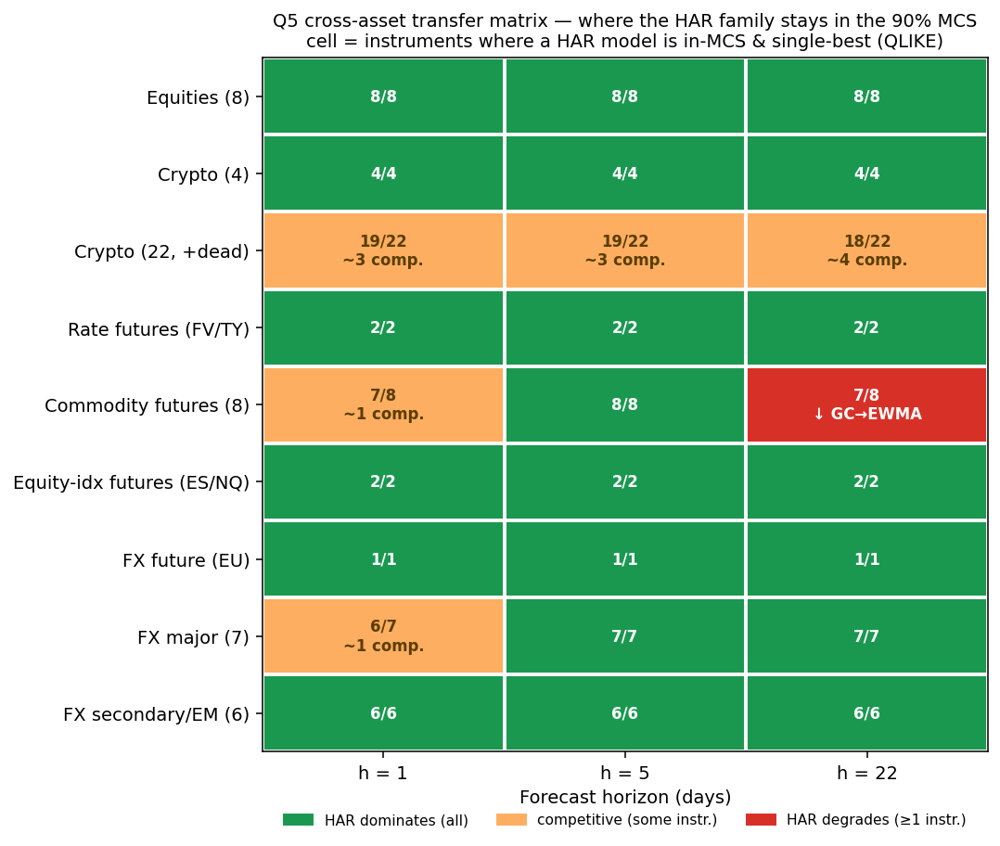

# volbench

[](https://github.com/batuhanboztepe0/volbench/actions/workflows/ci.yml)


## What this is

This is a reproducible, out-of-sample realized-variance forecasting benchmark. It implements all model-comparison tests (Diebold-Mariano + HLN correction, Model Confidence Set, Clark-West nested-model test) from scratch, matching reference libraries to machine precision. The two hard problems are look-ahead bias at horizons h > 1 (enforced and unit-tested per model) and proxy-robust loss functions (Patton 2011 QLIKE). The headline: **a correctly specified log-HAR is hard to beat**, replicated at scale across 37/39 futures cells and 38/39 FX cells, with a pre-specified cross-asset hypothesis that was mostly falsified.

## What I built

I implemented the Model Confidence Set, Diebold-Mariano + HLN, and Clark-West tests from scratch; the look-ahead-free expanding-window backtest harness; all realized estimators (bipower variation, realized kernel, semivariances, quarticity, BNS jump test); and the VaR and VRP layers. I set the research questions, the pre-specified decision rules, and did all result interpretation. Code was written with AI assistance (Claude); every statistical result is reproducible from the committed code and a fixed seed.

## Core result

DM + HLN, the Model Confidence Set, and Clark-West are built from scratch and match reference libraries to machine precision. The cross-asset study uses a pre-specified, falsifiable hypothesis reported with its largely-negative outcome. Log-HAR stays in the 90% Model Confidence Set across 37/39 futures cells and 38/39 FX cells, and machine learning does not displace it. The headline is a textbook result, replicated rigorously and at breadth. The primary pre-specified prediction (that rates futures would break HAR) was falsified and is logged as such.



> New here? The full leaderboard is below. **[Quickstart](#quickstart)** runs the whole pipeline end to end. **[Methodology in brief](#methodology-in-brief)** covers the rules that keep the results clean.

---

## Headline result

Out-of-sample QLIKE, eight indices, expanding-window walk-forward (about 5,000 test origins per index). Lower is better. **MCS** is the number of indices (out of 8) where the model survives in the 90% Model Confidence Set. **Beats HAR** counts indices where the model is significantly better than the level-HAR benchmark (Diebold-Mariano, 5%).

### One-day horizon (h = 1)

| Model        | Avg QLIKE | Avg rank | MCS (of 8) | Beats HAR |
|--------------|----------:|---------:|-----------:|----------:|
| **log-HAR**  | **0.187** | **1.12** | **8**      | 6         |
| GBRT (log)   | 0.196     | 2.75     | 1          | 2         |
| ARFIMA (log) | 0.197     | 2.75     | 0          | 4         |
| HAR          | 0.198     | 3.38     | 2          | n/a       |
| AR(1)-log    | 0.239     | 5.50     | 0          | 0         |
| EWMA         | 0.244     | 5.88     | 0          | 0         |
| MA(22)       | 0.262     | 7.00     | 0          | 0         |
| Random walk  | 0.468     | 7.75     | 0          | 0         |
| Hist. mean   | 0.651     | 8.88     | 0          | 0         |

The same ordering holds at one-week (h = 5) and one-month (h = 22) horizons. **Log-HAR is in the Model Confidence Set for all 8 indices at every horizon** and is the single best model in the large majority of index-horizon cells. At h = 5 log-HAR is significantly better than level-HAR on **all 8** indices. The gradient-boosted model and the long-memory **ARFIMA** trade places as the closest non-HAR competitors (GBRT runner-up at h = 5, ARFIMA at h = 22). Neither displaces log-HAR at any horizon.

**What this says.**

- A correctly specified log-space HAR is hard to beat. Modelling log-variance (which respects positivity and the heavy right tail of variance) is worth more than model complexity.
- Machine learning does not win here. A gradient-boosted model on HAR features is competitive but does not displace log-HAR out of sample on daily data without microstructure-grade features. This is reported rather than tuned away.
- The naive baselines lose decisively. The historical mean and the random walk are significantly worse than HAR on every index.

---

## Cross-asset generalisation: where does log-HAR stop winning?

The equity headline is a textbook result. The distinctive question is: **does it generalise, and where does it break?** It is answered under an internal, pre-specified protocol. The decision rules were fixed in advance and are author-attested as a discipline. The protocol is **not** externally registered, timestamped, or published to this public repo, so the claim is "pre-specified internally" not "pre-registered externally." A single falsifiable hypothesis predicts that the HAR family dominates mature, calendar-synchronised markets and degrades under reversed leverage (crypto), 24/7 calendars, microstructure noise, or event-driven breaks (commodities, rates). The primary deliverable is the **Q5 transfer matrix**: where a HAR-family model stays in the 90% Model Confidence Set (QLIKE), across asset classes and horizons.

**What the matrix shows:**

- **Log-HAR is robust at the level.** A HAR-family model is in the 90% MCS and single-best across equities (8/8), surviving major crypto (4/4), the survivorship-corrected 22-coin universe (18-19/22), US Treasury futures (FV/TY), 37/39 futures cells, and **38/39 FX cells** (7 majors + 6 EM/secondary pairs). These counts are unchanged at the stricter **alpha = 0.25** MCS (a smaller, harder-to-enter set) with no per-instrument verdict flips, so the dominance is not an artifact of the 90% level (`results/tables/transfer_matrix_alpha_sensitivity.csv`).
- **The primary pre-specified prediction was falsified.** The headline bet was that **rates futures (FV/TY)** would break HAR around the FOMC/auction calendar. They did not. HAR dominates both at every horizon. This is logged as a falsified prediction in the internal protocol's amendment log, not reframed.
- **The only genuine degrade is gold (GC) @ h = 22** (the single red cell above), where the MCS collapses to {EWMA} (EWMA beats the best HAR variant by about 25%). It is adversarially verified as robust (stable across 7 seeds and B in {2k...20k}) but isolated (no metals gradient) and partly mechanical (long-horizon estimation-risk immunity of a parameter-light smoother), at a secondary horizon. It does not satisfy the hypothesis's predicted-mechanism clause.
- **Equity-tuned refinements do not transfer to log-HAR.** HARQ never DM-beats log-HAR outside equities (0/22 crypto, 0/13 futures, 0/13 FX). It does beat plain (un-logged) HAR in a minority of cells (about 2/13 futures, 2/13 FX, 5/22 crypto at h = 1), so the quarticity correction carries some value off-equity, but the log transform already captures it. LogSHAR's downside-semivariance edge vanishes in crypto (0/22 at h = 1) but partly carries to FX (4-7/13). Only the refinements fail, not log-HAR itself.

**Verdict.** The confirmatory outcome is mixed, leaning "replication at scale": one unpredicted, secondary, partly-mechanical degrade plus a falsified primary prediction. The contribution is breadth, rigor, and the negative results, not a new model.

Scripts: `scripts/run_volare_futures.py`, `run_volare_fx.py`, `run_crypto_expanded.py`, `build_transfer_matrix.py`.

---

## Supporting tracks

### Economic value and the variance risk premium

On the S&P 500, implied vol (VIX) averages 21.5% vs 16.3% realized. The premium is positive 92% of days. A short-variance book earns a per-swap Sharpe of **~0.39** on non-overlapping payoffs, and the advantage is decisive after a **Deflated Sharpe** test (PSR >= 0.9996 across all three book configurations: always-short 0.9999; timed and long-short 0.9996). Timing the short with the log-HAR forecast lifts the overlapping-payoff Sharpe from 1.45 to 1.60 and cuts max drawdown by about 65%. Those overlapping Sharpes are inflated by autocorrelation in 22-day windows; read the lift over the naive book and the drawdown cut, which survive realistic costs. The variance risk premium is real, not a selection artifact. `scripts/run_vrp.py`.

A vol-targeting strategy (scale exposure by target_vol / forecast_vol, net of costs) holds realized vol near target and cuts max drawdown by 20-49% (median about 34%) vs buy-and-hold. It improves Sharpe mainly on the US indices (and marginally on HSI). PSR is credibly > 0 only on SPX/DJI (PSR about 0.96); on FTSE/CAC/STOXX it is indistinguishable from zero (PSR < 0.5). Vol targeting is a risk-control tool, not free alpha. `scripts/run_strategy.py`.

---

## Other tracks

- **HAR family (which variant wins).** Using real bipower variation, jump variation and realized semivariances: log variants dominate level variants, and LogSHAR and LogHAR-CJ edge plain log-HAR. Downside-semivariance carries real predictive content. `scripts/run_har_family.py`.
- **Cross-index spillover.** Adding the other seven indices' lagged realized variance to a target index's HAR (CrossHAR) lowers QLIKE for all 8 indices (about 1.7-8% at h = 1). Because CrossHAR nests LogHAR, significance is judged by the **Clark-West (2007) nested-model test**: CrossHAR significantly improves on LogHAR for **7 of 8 indices at h = 1** (all but SPX) and 4 of 8 at h = 5. `scripts/run_multivariate.py`.
- **ML (does ML win on richer features?).** LightGBM and XGBoost (an MLP was also evaluated but excluded as data-starved on about 5,000 daily observations), each fit in log-variance space with leakage-free expanding-window hyperparameter tuning on a plain HAR feature set and an enriched one. Even with a fair quarterly refit cadence, **no ML model displaces log-HAR**. `scripts/run_ml.py`.
- **GARCH reference (Track 2).** On real S&P 500 daily returns (2000-2022), scored against squared returns. GJR-GARCH and plain GARCH edge RiskMetrics. This track is not directly comparable to Track 1 (different proxy quality; QLIKE levels are an order of magnitude higher). `scripts/run_garch.py`.
- **VaR (an open problem).** A direct-quantile CAViaR (Engle-Manganelli) layer with a same-window GARCH/GJR-GARCH/EWMA comparison. Normal VaR under-covers (about 9.1% at nominal 5%); FHS improves coverage (about 6.5%) but fails the dynamic-quantile (DQ) test. On a common window GJR-GARCH is the best VaR engine (DQ pass 3/8). The leverage channel, not the modelling paradigm, is what matters. Full DQ adequacy stays unsolved. `scripts/run_caviar.py`.
- **Crypto generality (Track 3).** Real Binance 5-minute bars for BTC/ETH/BNB/SOL. Log-HAR is #1 and in the MCS for all four coins at every horizon. HARQ does not transfer (heavy-tailed RQ makes it the worst model). Cross-coin spillover is weak. These are surviving large coins only; dead coins are not in the panel. `scripts/build_crypto.py`, `scripts/run_crypto.py`.
- **Regime analysis.** Calm vs turbulent states, GFC and COVID windows. Log-HAR stays rank-1 with MCS 8/8 in calm, turbulent and GFC regimes. The gap to naive baselines widens sharply in crises. The 93-day COVID window is too short for the MCS to separate models. `scripts/run_regime.py`.

---

## Estimators are validated, not assumed

The realized estimators in `volbench.realized` are validated on simulated intraday paths with **known** integrated variance and jump variation (`scripts/validate_estimators.py`, 4,000 simulated days):

| Check                                   | Result | Target |
|-----------------------------------------|-------:|-------:|
| Realized variance / quadratic variation | 1.000  | 1.0    |
| Bipower variation / integrated variance (clean) | 0.998 | 1.0 |
| Median RV / integrated variance         | 0.998  | 1.0    |
| Bipower variation / integrated variance (with jumps) | 1.044 | n/a (finite-M bias) |
| (RV - bipower) / jump variation         | 0.926  | ~1.0   |
| Realized kernel / QV (clean)            | 1.003  | 1.0    |
| **Realized variance / QV (with noise)** | **3.00** (inflated) | n/a |
| **Realized kernel / QV (with noise)**   | **1.008** (robust)  | 1.0 |
| Jump-test false-positive rate @ 5%      | 0.052  | 0.05   |
| Jump-test detection rate (injected)     | 0.938  | high   |

Bipower variation is jump-robust only asymptotically: on jump-free paths it is unbiased (0.998), but on jump-contaminated days at M = 390 it carries a known finite-sample upward bias (1.044). That is why the headline forecasters model log-variance rather than relying on a level jump correction.

The microstructure point is the classic **volatility signature plot** (`results/figures/signature_plot.png`): under additive noise, realized variance explodes as the sampling frequency rises, while the realized kernel stays on the true quadratic variation.

---

## Repository layout

```
volbench/
├── src/volbench/
│   ├── realized.py      # realized estimators: RV, semivariance, bipower,
│   │                    #   medRV, quarticity, realized kernel, BNS jump test
│   ├── simulate.py      # intraday simulator (exp-OU log-variance + jumps +
│   │                    #   optional microstructure noise) with known IV/JV
│   ├── models.py        # forecasters: RW, HistMean, MA, EWMA, AR(1)-log,
│   │                    #   HAR, log-HAR, HARQ, GBRT, + HAR-J/HAR-CJ/SHAR family
│   ├── losses.py        # QLIKE & MSE (Patton-robust), Mincer-Zarnowitz
│   ├── evaluation.py    # Diebold-Mariano (+HLN), Model Confidence Set
│   ├── backtest.py      # expanding-window harness tying it together
│   ├── economic.py      # vol targeting, VaR (normal/t/FHS + Kupiec/Christoffersen/DQ)
│   ├── multivariate.py  # cross-index (spillover) HAR
│   ├── ml.py            # leakage-free LightGBM/XGBoost + forecast combination
│   ├── vrp.py           # variance risk premium signal + short-variance timing
│   ├── strategy.py      # vol-targeting backtest (with costs) + jump/regime overlay
│   └── data.py          # loaders (Oxford-Man RV; SP500 returns; VIX; crypto RV)
├── scripts/             # run_{benchmark,garch,har_family,multivariate,ml,economic,
│   │                    #   vrp,strategy,regime,crypto}, validate_estimators,
│   │                    #   make_figures, build_{realized,vix,crypto}
├── tests/               # pytest suite (239 tests)
├── data/                # VIX (committed) + provenance; RV and crypto CSVs are fetched
├── results/             # tables, figures, JSON summaries (the deliverable)
└── report/              # LaTeX research report
```

## Methodology in brief

- **Target.** Direct multi-horizon: forecast the average daily variance over the next `h` days, so every model is scored on an identical, comparable target.
- **No look-ahead.** At each origin `t`, regression models train only on observations whose realization window closed by `t` (rows `s` with `s + h <= t`). This is enforced and unit-tested for every model. It is a common silent bug for `h > 1`.
- **Robust losses.** QLIKE and MSE-on-variance are consistent under a noisy variance proxy (Patton, 2011); RMSE-on-volatility is reported for reference but never used to rank.
- **Significance.** Diebold-Mariano with a Newey-West HAC variance and the Harvey-Leybourne-Newbold small-sample correction; the Model Confidence Set with a moving-block bootstrap (2,000 replications for the equity benchmark; 10,000 for the pre-specified cross-asset arms).
- **Nested models.** When one model nests another (e.g., CrossHAR nests LogHAR), standard DM is not valid (Diebold 2015). The Clark-West (2007) test is used instead.

## Quickstart

```bash
pip install -e ".[dev]"        # package + pytest/ruff/mypy
# or: pip install -r requirements.lock   # pinned versions

python scripts/build_realized.py         # STEP 0: fetch the RV data (one-time, ~6 MB,
                                         #   from the Internet Archive); VIX is bundled

# Docker alternative:
docker build -t volbench . && docker run --rm -v "$PWD/results:/app/results" volbench make reproduce

make reproduce                 # the full pipeline end to end (or run individually):
python scripts/validate_estimators.py    # results/validation.json
python scripts/run_benchmark.py          # results/summary.json + tables  (Track 1)
python scripts/run_garch.py              # results/garch.json             (Track 2)
python scripts/run_har_family.py         # results/har_family.json
python scripts/run_multivariate.py       # results/multivariate.json
python scripts/run_ml.py                 # results/ml.json  (LightGBM/XGBoost)
python scripts/run_economic.py           # results/economic.json
python scripts/run_vrp.py               # results/vrp.json  (variance risk premium)
python scripts/run_strategy.py           # results/strategy.json  (vol targeting)
python scripts/run_regime.py             # results/regime.json
python scripts/build_crypto.py           # data/crypto_realized.csv (Binance 5-min bars)
python scripts/run_crypto.py             # results/crypto.json  (Track 3: BTC/ETH/BNB/SOL)
python scripts/make_figures.py           # results/figures/*.png
pytest -q                                # 239 tests
```

Minimal programmatic use:

```python
from volbench.data import load_oxford_rv
from volbench.backtest import run_backtest

rv = load_oxford_rv().series(".SPX")          # daily realized variance
res = run_backtest(rv, horizon=1)             # walk-forward all models
print(res.mcs["QLIKE"].included)              # models in the 90% MCS
```

Or the CLI: `volbench run --ticker .SPX --horizon 1`.

## Caveats and limitations

- The Oxford-Man library ships realized measures but not raw intraday returns, and it has no realized-quarticity column, so the jump/semivariance estimators and the BNS jump test are validated on simulation, and HARQ (which needs realized quarticity) runs on the simulation track only.
- The realized kernel is mildly inefficient on near-noiseless data; it matters under noise, which is exactly where it is shown to help. The core benchmark uses the daily RV series directly.
- Track 2's GARCH-on-returns is a deliberately separate reference, not a competitor to Track 1's HAR-on-RV.
- Normal VaR in the economic layer under-covers because daily index returns are fat-tailed; this is reported as a finding, not hidden.
- The expanding-window harness is batch-oriented. Live use would need incremental RV estimation from a high-frequency feed.
- Code was written with AI assistance (Claude). The author set the research questions, the methodology, and all pre-specified decision rules, reviewed and verified all code and results, and is responsible for any errors.

## References

- Andersen, Bollerslev, Diebold & Labys (2003); Corsi (2009), HAR-RV.
- Andersen, Bollerslev & Diebold (2007), HAR-CJ continuous/jump split.
- Barndorff-Nielsen & Shephard (2004, 2006), bipower variation and jump tests.
- Barndorff-Nielsen, Hansen, Lunde & Shephard (2008), realized kernels.
- Patton (2011), volatility forecast evaluation with imperfect proxies.
- Patton & Sheppard (2015), good and bad volatility / semivariance HAR.
- Hansen, Lunde & Nason (2011), the Model Confidence Set.
- Bollerslev, Patton & Quaedvlieg (2016), HARQ.
- Clark & West (2007), approximately normal tests for equal predictive accuracy.
- Heber, Lunde, Shephard & Sheppard (2009), Oxford-Man Realized Library.

## License

MIT licence. See [LICENSE](LICENSE). The Oxford-Man data is **not** redistributed here (licence unclear). Only VIX (sourced from FRED, public domain) is bundled. See [`data/README.md`](data/README.md) for data provenance and fetch instructions.
